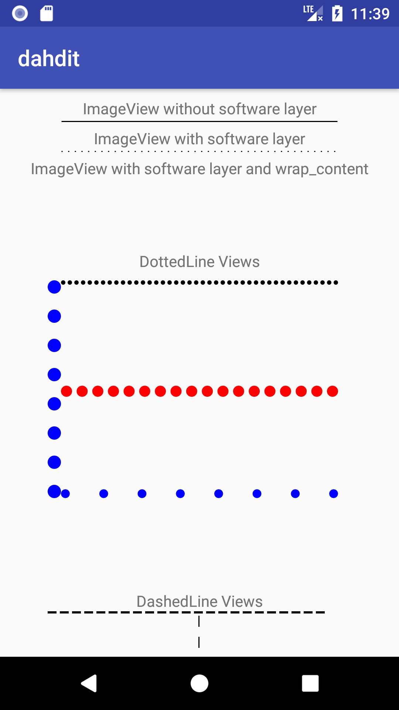

# DahDit - Better Dots and Dashes in Android
Drawing a round-dotted line or a dashed line with a shape drawable in Android requires you to disable hardware rendering due to some bugs. It also doesn't play nice with wrap_content. Let's not worry about that anymore.

## Usage
You can use _com.xfinity.dahdit.DottedLine_ or _com.xfinity.dahdit.DashedLine_ as a view in XML. By default, the line will be drawn horizontally, with dots of diameter 4dp with minimum 2dp spacing.

## Spacing
The library will calculate the correct amount of spacing to add between dots in order to ensure the dots are flush to the ends of your included View.

## Customizable
The View can have the dot's radius, dash's height/width, the minimum gap between dots/dashes, the color, and the orientation of the line customized in XML.

## In Action

Here's what the sample app looks like if you launch it:



Note the ImageView using wrap_content can't be seen at all. Meanwhile, all the dashed and dotted lines fit nicely, and flush their dots/dashes to the edge of their view.

## Using DahDit

DahDit is available on MavenCentral. To use DahDit, in your project build.gradle add

```xml
compile 'com.xfinity:dahdit:0.9.3'
```
